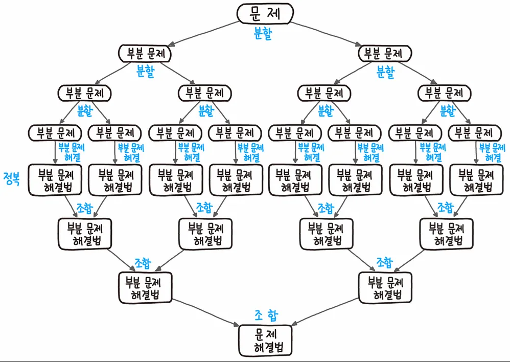

# 분할 정복 알고리즘

분할 정복 알고리즘(Divide and conquer)은 문제를 반씩 나누어 해결하고, 하위 문제에 대한 결과를 원래 문제에 대한 결과로 조합해 해결하는 알고리즘이다.

## 특징
1. 문제를 두 개 이상의 작은 문제로 나눈다.
2. 각각의 작은 문제를 재귀적으로 해결한다
3. 해결한 결과를 병합하여 최종 답을 얻는다.

## 예시
### 병합 정렬
```C++
#include <iostream>
#include <vector>
using namespace std;

void merge(vector<int>& arr, int left, int mid, int right) {
    vector<int> temp(right - left + 1);
    int i = left, j = mid + 1, k = 0;

    while (i <= mid && j <= right)
        temp[k++] = (arr[i] < arr[j]) ? arr[i++] : arr[j++];
    while (i <= mid) temp[k++] = arr[i++];
    while (j <= right) temp[k++] = arr[j++];
    
    for (int i = 0; i < temp.size(); i++) arr[left + i] = temp[i];
}

void mergeSort(vector<int>& arr, int left, int right) {
    if (left >= right) return;
    int mid = (left + right) / 2;
    mergeSort(arr, left, mid);
    mergeSort(arr, mid + 1, right);
    merge(arr, left, mid, right);
}

int main() {
    vector<int> arr = {5, 2, 9, 1, 5, 6};
    mergeSort(arr, 0, arr.size() - 1);
    for (int num : arr) cout << num << " ";
}
```

### 거듭제곱 계산
```C++
#include <iostream>
using namespace std;

long long power(long long x, long long n) {
    if (n == 0) return 1;
    long long half = power(x, n / 2);
    return (n % 2 == 0) ? half * half : half * half * x;
}

int main() {
    cout << power(2, 10);
}
```

# Meet in the middle?
Meet in the middle 기법은 분할 정복 알고리즘처럼 문제를 반으로 나누지만 하위 문제를 계속 나누는 것이 아닌 두 개의 문제로 나누는 차이가 있다.
완전 탐색으로 풀기 어려운 문제를 해결할 때 사용되며, 시간 복잡도를 O(2^(N/2)) 수준으로 줄이는 것이 목표다.

- [관련 알고리즘 문제](https://www.acmicpc.net/problem/1182)
- [해답](https://duplicated.tistory.com/114)