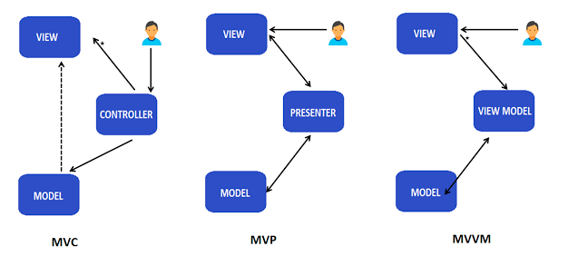

# MVVM 패턴 정의

 

### **MVVM (Model-View-ViewModel)** 패턴은 Model View, View, Model의 약자로 프로그램의 비지니스 로직과, 프레젠테이션 로직을 UI로 명확하게 분리하는 패턴입니다.

 

### **Model**

데이터를 다루는 부분. 비즈니스 로직을 포함한다.

- 데이터 관리 및 데이터관련 비즈니스 로직을 담당하는 부분입니다.
- **데이터를 가져오고 저장하는 역할**을 수행합니다.
- 보통 데이터베이스, 네트워크 요청 또는 파일 시스템과 같은 데이터 소스와 상호 작용합니다.

### **View**

레이아웃과 화면을 보여주는 역할

- 사용자 인터페이스를 담당하는 부분입니다.
- 사용자가 보는 화면을 표시하고, 사용자 입력을 처리합니다.
- 보통 XAML과 같은 마크업 언어를 사용하여 디자인됩니다.

### **ViewModel**

- View와 Model 사이에서 중재자 역할을 수행합니다.
- **뷰가 사용할 메서드와 필드를 구현합니다.**
- View에서 발생하는 이벤트를 감지하고, 해당 이벤트에 맞는 비즈니스 로직을 수행합니다.
- Model과 상호작용하여 데이터를 가져오거나 업데이트하고, View에 데이터를 업데이트하는 역할을 합니다.
- View에 표시할 데이터를 가공하여 제공하는 역할을 합니다.

  

# MVVM 동작 과정

1. 사용자의 Action들은 View를 통해 들어옵니다.
2. View에 Action이 들어오면 ViewModel에 Action을 전달합니다.
3. ViewModel은 Model에게 데이터를 요청합니다.
4. Model은 ViewModel에게 요청받은 데이터를 응답합니다.
5. ViewModel은 응답 받은 데이터를 가공하여 저장합니다.
6. View는 Data Binding을 이용해 UI를 갱신시킵니다.

# MVVM 특징

**MVVM은 View와 ViewModel사이의 관계가 1대n**으로 되어있습니다. 또한 데이터 바인딩을 이용한다면 **View**와 **ViewModel** 사이의 의존성을 없앨 수 있습니다.
  

# MVVM 단점

- 설계하기가 복잡하다. (Rx,데이터 바인딩에 대한 지식 필요)
- 뷰모델이 비대해질 수 있다.
- 데이터 바인딩으로 인한 메모리 소모가 심하다.
- ViewModel 설계가 복잡하다는 단점이 있습니다.
