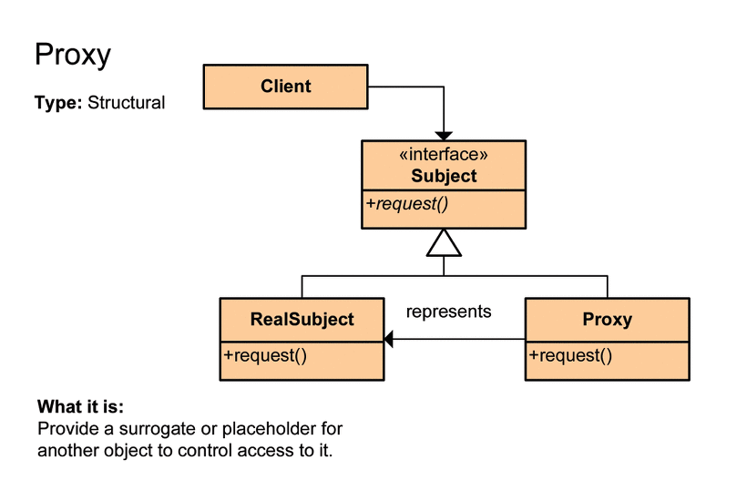
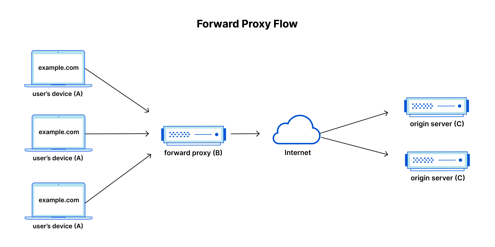

# 

## **프록시 패턴 (Proxy Pattern)**



- 객체에 대한 접근을 제어하기 위해 대리 객체(프록시)를 제공하는 디자인 패턴
- 클라이언트가 직접 대상 객체(Real Subject)에 접근하지 않고, 프록시를 통해 제어

### 유형

| 유형 | 설명 | 대표 예제 |
| --- | --- | --- |
| **원격(Remote) 프록시** | 네트워크를 통해 원격 객체를 호출 | 원격 API 호출, RMI, HTTP 프록시 |
| **가상(Virtual) 프록시** | 무거운 객체의 생성을 지연(지연 로딩) | 이미지 로딩, ORM(Lazy Loading) |
| **보호(Protection) 프록시** | 접근 제어(권한 관리) | 접근 권한 제어 |
| **캐싱(Cache) 프록시** | 자주 쓰는 데이터를 저장하여 성능 향상 | CDN, API 캐싱, DB 캐싱 |
| **스마트(Smart) 프록시** | 원래 객체에 추가 기능 부여 | 로깅, 암호화, 트랜잭션 |

### 예제: 이미지 업로드

**인터페이스**

```java
public interface Image {
    void display();
}
```

**실제 객체**

```java
public class RealImage implements Image {
    private String filename;

    public RealImage(String filename) {
        this.filename = filename;
        loadFromDisk();
    }

    @Override
    public void display() {
        System.out.println("Displaying " + filename);
    }

    private void loadFromDisk() {
        System.out.println("Loading : " + filename);
    }
}
```

**가상 프록시**

실제로 이미지는 `display()` 호출 시점에 로드된다.

```java
public class ProxyImage implements Image {
    private RealImage realImage;
    private String filename;

    public ProxyImage(String filename) {
        this.filename = filename;
    }

    @Override
    public void display() {
        if (realImage == null) {
            realImage = new RealImage(filename);  // 실제 객체를 처음 사용할 때 생성
        }
        realImage.display();
    }
}
```

**클라이언트 코드**

클라이언트는 `ProxyImage`를 사용

```java
public class ProxyPattern {
    public static void main(String[] args) {
        Image image1 = new ProxyImage("image1.jpg");
        Image image2 = new ProxyImage("image2.jpg");

        // 이미지가 필요할 때 로드
        image1.display();
        image2.display();
    }
}
```

**실행 결과**

```
Loading : image1.jpg
Displaying image1.jpg
Loading : image2.jpg
Displaying image2.jpg
```


---

## **프록시 서버 (Proxy Server)**



- 클라이언트와 서버 사이에 위치하여 요청을 중계하는 서버
- 보안, 성능 최적화, 익명성 보호 등의 역할 수행
- 보안 강화, 속도 개선, 우회 접속, 로깅 및 트래픽 관리 등

### **역할**

| 역할 | 설명 | 예시 |
| --- | --- | --- |
| **보안 강화** | 사용자의 실제 IP를 숨기고, 방화벽 기능 수행 | VPN |
| **캐싱 & 속도 향상** | 자주 방문하는 페이지를 저장하여 로딩 속도 개선 | CDN |
| **접근 제한** | 특정 웹사이트 차단, 기업/학교의 인터넷 정책 적용 | 사내 내부망 |
| **로그 & 모니터링** | 사용자 트래픽 기록, 네트워크 분석 및 감사 | 기업 보안 관리, 정부 감시 |
| **우회 접속** | 차단된 사이트나 지역 제한 콘텐츠 접근 가능 | 유튜브, 넷플릭스 우회 |

### **유형**

| 유형 | 설명 | 예제 |
| --- | --- | --- |
| **정방향(Forward) 프록시** | 클라이언트 → 프록시 서버 → 인터넷 | 기업 내부망, VPN |
| **역방향(Reverse) 프록시** | 클라이언트 → 프록시 서버 → 내부 서버 | 로드 밸런싱, Nginx |
| **트랜스페어런트(Transparent) 프록시** | 클라이언트가 프록시를 인식하지 못함 | 기업, 공공 와이파이 |
| **공개(Open) 프록시** | 누구나 사용할 수 있는 프록시 | 무료 프록시 서버 |

## 프록시 패턴과 서버

|  | 프록시 패턴 | 프록시 서버 |
| --- | --- | --- |
| 개념 | 객체 앞에 대리 객체(Proxy)를 두어 간접 접근 | 클라이언트와 서버 사이에서 요청을 중계 |
| 주요 목적 | 성능 최적화, 접근 제어, 로깅 | 보안 강화, 캐싱, 익명성 제공 |
| 사용 위치 | 애플리케이션 내부 (코드 레벨) | 네트워크 구조 (클라이언트-서버 사이) |

---
## **프록시 서버 와 VPN**

### **프록시 서버 (Proxy Server)**

- 특정 애플리케이션(웹 브라우저, 특정 프로그램)의 요청만 중계
- IP 주소를 변경하거나 웹 콘텐츠 필터링 등에 사용
- 트래픽이 **암호화되지 않으며**, 보안보다는 우회 및 캐싱이 주목적

### **VPN (Virtual Private Network)**

- 사용자의 **모든 네트워크 트래픽을 암호화**하여 보호
- **사용자의 전체 인터넷 트래픽을 보호**하여, 위치를 숨기고 감청을 방지
- 공용 네트워크에서도 안전한 통신을 보장

|  | 프록시 서버 | VPN  |
| --- | --- | --- |
| **동작 방식** | 특정 요청(HTTP/HTTPS, DNS 등)만 중계 | 모든 네트워크 트래픽을 암호화하여 터널링 |
| **보안 수준** | 낮음 (일반적으로 암호화 없음) | 높음 (모든 트래픽 암호화) |
| **IP 숨김 기능** | 일부 가능 (웹사이트에는 숨겨짐) | 전체 네트워크에서 IP 숨김 |
| **속도** | 빠름 (캐싱 활용 가능) | 상대적으로 느림 (암호화로 인한 오버헤드 발생) |
| **익명성** | 제한적 (웹 트래픽만 보호) | 강력한 익명성 보장 |
| **사용 목적** | 웹 필터링, 캐싱, 차단된 콘텐츠 우회 | 보안 강화, 데이터 암호화, 감시 회피 |

**프록시 서버** → 특정 요청만 중계 (웹 필터링, IP 변경, 캐싱)

**VPN** → 모든 네트워크 트래픽을 암호화하여 보안 강화

👉 **보안이 중요하다면 VPN을, 단순한 IP 우회나 캐싱이 필요하다면 프록시를 사용**

---

[https://inpa.tistory.com/entry/GOF-💠-프록시Proxy-패턴-제대로-배워보자](https://inpa.tistory.com/entry/GOF-%F0%9F%92%A0-%ED%94%84%EB%A1%9D%EC%8B%9CProxy-%ED%8C%A8%ED%84%B4-%EC%A0%9C%EB%8C%80%EB%A1%9C-%EB%B0%B0%EC%9B%8C%EB%B3%B4%EC%9E%90)

https://refactoring.guru/design-patterns/proxy

[https://effectiveprogramming.tistory.com/entry/Proxy-패턴과-그-활용](https://effectiveprogramming.tistory.com/entry/Proxy-%ED%8C%A8%ED%84%B4%EA%B3%BC-%EA%B7%B8-%ED%99%9C%EC%9A%A9) 

https://nordvpn.com/ko/blog/proxy-versus-vpn/
https://www.cloudflare.com/ko-kr/learning/cdn/glossary/reverse-proxy/